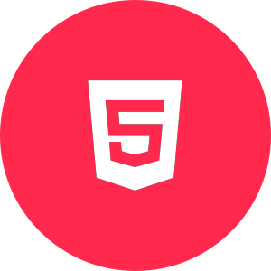

<!DOCTYPE html>
<html lang="en">
<head>
    <meta charset="UTF-8">
    <meta name="viewport" content="width=device-width, initial-scale=1.0">
    <link rel="stylesheet" href="github-markdown.css">
</head>
<body>
    

        
        <h2>HI! &#128075; I'm Andrew!</h2>
        

            Da sempre appassionato di comunicazione, arte, design e tecnologia. Dai tempi della scuola iniziano i miei primi contatti col mondo della grafica, del cinema e della progettazione web. Nel 2018 inizia la mia carriera universitaria come Graphic Designer.
        

        

            Dopo la laurea continuo ad approfondire i miei studi, sia in ambito di UX/UI design, sia in ambito dello sviluppo web tramite Boolean, facendomi appassionare sempre di più a questo mondo giorno dopo giorno. Sono una persona fortemente determinata e volenterosa, aperta a nuove opportunità e pronta a mettersi in gioco.
        

        

        

            
<strong>Technologies: </strong> &#128187;

            
            
            
            
            
            
            
            
            
            
            
            
            
            
            
            
            
        

        

        

            <strong>Contact me:</strong>
             
             
            
            
        

    

</body>
</html>