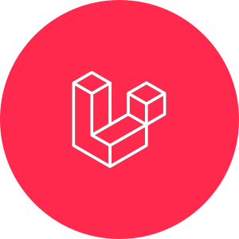

<!DOCTYPE html>
<html lang="en">
<head>
    <meta charset="UTF-8">
    <meta name="viewport" content="width=device-width, initial-scale=1.0">
    <link rel="stylesheet" href="github-markdown.css">
</head>
    <body>
        

            
            <h2>HI! &#128075; I'm Andrew!</h2>
            

                Da sempre appassionato di comunicazione, arte, design e tecnologia. Dai tempi della scuola iniziano i miei primi contatti col mondo della grafica, del cinema e della progettazione web. Nel 2018 inizia la mia carriera universitaria come Graphic Designer.
            

            

                Dopo la laurea continuo ad approfondire i miei studi, sia in ambito di UX/UI design, sia in ambito dello sviluppo web tramite percorsi specializzati all'acquisizione di competenze di sviluppo web, facendomi appassionare sempre di più a questo mondo giorno dopo giorno. Sono una persona fortemente determinata e volenterosa, aperta a nuove opportunità e pronta a mettersi in gioco.
            

            

            

                <h2><strong>Technologies: </strong> &#128187;</h2>
                &nbsp;&nbsp;&nbsp;
                &nbsp;&nbsp;&nbsp;
                &nbsp;&nbsp;&nbsp;
                &nbsp;&nbsp;&nbsp;
                &nbsp;&nbsp;&nbsp;
                &nbsp;&nbsp;&nbsp;
                &nbsp;&nbsp;&nbsp;
                &nbsp;&nbsp;&nbsp;
                &nbsp;&nbsp;&nbsp;
                &nbsp;&nbsp;&nbsp;
                &nbsp;&nbsp;&nbsp;
                &nbsp;&nbsp;&nbsp;
                &nbsp;&nbsp;&nbsp;
                &nbsp;&nbsp;&nbsp;
                &nbsp;&nbsp;&nbsp;
                &nbsp;&nbsp;&nbsp;
                &nbsp;&nbsp;&nbsp;
            

            

            

                <strong>Contact me:</strong>
                 
                 
                
                
                
            

        

    </body>
</html>